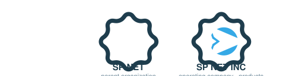

  

  
  <a href="https://sp-net.in"><strong>sp-net.in</strong></a>
  &nbsp;·&nbsp;
  
  <a href="https://spnetinc.com"><strong>spnetinc.com</strong></a>
  &nbsp;·&nbsp;
  
  <a href="mailto:savan@sp-net.in"><strong>savan@sp-net.in</strong></a>

  

---

## Intro

I build software, platforms, and infrastructure from the underlying systems up — shared
foundations of identity, data, and services that let an entire ecosystem move as one. My
work spans web, mobile, messaging, and blockchain, engineered to be tested, documented,
and durable. The best way to understand it is below.

---

## Organization

**SP NET** is the parent organization. **SP NET INC** is the company operating under it,
owning and engineering the ecosystem's products and platforms.

  

---

## Building

<table align="center">
  <tr>
    <td align="center" width="50%" valign="top">
       
      <strong>SavaroX</strong> 
      A Layer-1 blockchain built from first principles — consensus, nodes, wallets, SDK, and explorer.  TypeScript · Consensus · SDK <b>Building</b>
    </td>
    <td align="center" width="50%" valign="top">
       
      <strong>SP NET GRAM</strong> 
      A messaging platform for privacy, premium experiences, and deep customization.  Messaging · Premium · Cross-platform <b>Building</b>
    </td>
  </tr>
  <tr>
    <td align="center" width="50%" valign="top">
       
      <strong>SP NET ADMIN OS</strong> 
      Enterprise administration — role-based access, audit, analytics, and moderation.  RBAC · Audit · Analytics <b>Building</b>
    </td>
    <td align="center" width="50%" valign="top">
       
      <strong>SP NET Platform</strong> 
      The private backend behind every product — identity, products, services, and a platform OS.  NestJS · PostgreSQL · Prisma <b>Private</b>
    </td>
  </tr>
</table>

Also: <strong>Portfolio</strong> (personal product hub) · <strong>Helpdesk</strong> (multi-channel support). Code is published as repositories on this profile.

  

---

## Technology

| Area | Stack |
|---|---|
| **Frontend** |     |
| **Backend** |    |
| **Mobile** |  |
| **Data & Infra** |      |
| **Delivery** |  Monorepos · pnpm · strict TypeScript · CI on every repo |

---

## Contact

-  **SP NET** (parent organization) — <a href="https://sp-net.in">sp-net.in</a>
-  **SP NET INC** (company) — <a href="https://spnetinc.com">spnetinc.com</a>
-  **Email** — <a href="mailto:savan@sp-net.in">savan@sp-net.in</a>

---

© 2026 Savan Patel · Founder &amp; Engineer, SP NET INC
