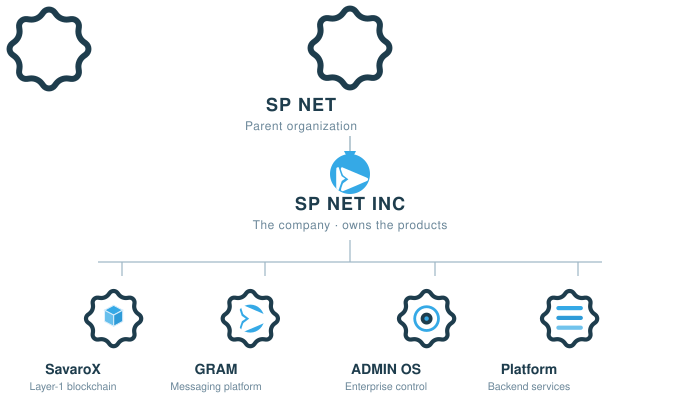
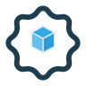

  

  <a href="#ecosystem"><strong>Ecosystem</strong></a>
  &nbsp;·&nbsp;
  <a href="#building"><strong>Building</strong></a>
  &nbsp;·&nbsp;
  <a href="#approach"><strong>Approach</strong></a>
  &nbsp;·&nbsp;
  <a href="#technology"><strong>Technology</strong></a>
  &nbsp;·&nbsp;
  <a href="#capabilities"><strong>Capabilities</strong></a>
  &nbsp;·&nbsp;
  <a href="#work"><strong>Work</strong></a>
  &nbsp;·&nbsp;
  <a href="#contact"><strong>Contact</strong></a>

  

---

<h2 id="intro">Intro</h2>

I build software, platforms, and infrastructure from the underlying systems up. My work
rests on shared foundations of identity, data, and services so an entire ecosystem can
move as one — spanning web, mobile, messaging, and blockchain, engineered to be tested,
documented, and durable.

Three pillars shape everything I ship:

- **Communication** — products that connect people and businesses.
- **Ownership** — the enterprise control layer that keeps it all governed.
- **Community** — infrastructure that lets a network grow itself.

The best way to understand how these fit together is below.

  

---

<h2 id="ecosystem">Ecosystem</h2>

**SP NET** is the parent organization. **SP NET INC** is the company operating under it —
owning and engineering the products and platforms of the ecosystem.

  

  

---

<h2 id="building">Building</h2>

A deep technical stack, designed as a coherent whole — every product shares the same
identity, data, and service foundations that power it.

<table align="center">
  <tr>
    <td align="center" width="50%" valign="top">
       
      <strong>SavaroX</strong> 
      
        A Layer-1 blockchain built from first principles — consensus, nodes, wallets, an
        SDK, and a block explorer. Native currency <b>SRX</b>.  
        TypeScript · Consensus · Distributed systems 
        <b>Building</b>
      
    </td>
    <td align="center" width="50%" valign="top">
       
      <strong>SP NET GRAM</strong> 
      
        A messaging platform built for privacy, premium experiences, and deep
        customization across every device.  
        Messaging · Privacy · Cross-platform 
        <b>Building</b>
      
    </td>
  </tr>
  <tr>
    <td align="center" width="50%" valign="top">
       
      <strong>SP NET ADMIN OS</strong> 
      
        Enterprise administration — role-based access, audit logging, analytics, and
        moderation for an entire network.  
        RBAC · Audit · Analytics 
        <b>Building</b>
      
    </td>
    <td align="center" width="50%" valign="top">
       
      <strong>SP NET Platform</strong> 
      
        The private backend behind every product — identity, services, products, and the
        platform OS the ecosystem runs on.  
        NestJS · PostgreSQL · Prisma 
        <b>Private</b>
      
    </td>
  </tr>
</table>

Also: <b>Portfolio</b> (personal product hub) · <b>Helpdesk</b> (multi-channel support).
Code is published as repositories on this profile.

---

<h2 id="approach">Engineering Approach</h2>

I don't stack features — I build foundations, then let products stand on them.

- **Systems thinking** — shared identity, data, and services first; products are thin
  clients on top of a coherent platform.
- **From first principles** — no magic boxes; each layer is understood, tested, and
  documented all the way down.
- **Durable by default** — strict TypeScript, monorepos, automated CI on every repository,
  and code designed to be picked up years later.
- **Private core, public proof** — the platform backend stays internal, while products and
  engineering depth are published as repositories you can actually read.

---

<h2 id="technology">Technology</h2>

Tools I reach for when I need something real and durable.

| Area | Stack |
|---|---|
| **Frontend** |     |
| **Backend** |    |
| **Mobile** |  |
| **Data &amp; Infra** |    |
| **Delivery** |    Monorepos · pnpm · strict TypeScript · CI on every repo |

---

<h2 id="capabilities">Engineering At A Glance</h2>

| Domain | Capability |
|--------|-----------|
| **WEB** |     Full-stack web applications and product sites |
| **BACKEND** |      Platform APIs, services, and data layers |
| **MOBILE** |  Cross-platform mobile applications |
| **INFRA** |     CI/CD, containers, and deployment pipelines |
| **BLOCKCHAIN** |  Consensus, wallets, and distributed systems |

---

<h2 id="building-now">Currently Building</h2>

  

Right now I'm deepening the foundations behind the ecosystem — hardening the shared
backend that every product runs on, progressing the SavaroX blockchain, and shipping the
products listed above. The work is slow, deliberate, and built to last.

This is my active focus — details land in the repositories above as each piece becomes public.

---

<h2 id="work">Selected Work</h2>

Representative pieces of engineering, design, and product — published as repositories on
this profile.

<table align="center">
  <tr>
    <td align="center" width="33%" valign="top">
       
      <strong>SavaroX</strong> 
      Layer-1 blockchain — consensus, nodes, wallets, SDK, explorer.
    </td>
    <td align="center" width="33%" valign="top">
       
      <strong>SP NET Website</strong> 
      Brand anchor for the parent SP NET organization.
    </td>
    <td align="center" width="33%" valign="top">
       
      <strong>SP NET Admin</strong> 
      Enterprise administration — RBAC, audit, analytics, moderation.
    </td>
  </tr>
  <tr>
    <td align="center" width="33%" valign="top">
       
      <strong>SP NET GRAM</strong> 
      Product site for the messaging platform.
    </td>
    <td align="center" width="33%" valign="top">
       
      <strong>Portfolio</strong> 
      Personal product hub — engineering, design, and founder story.
    </td>
    <td align="center" width="33%" valign="top">
       
      <strong>SPNG Helpdesk</strong> 
      Multi-channel business communication — email, WhatsApp, chat.
    </td>
  </tr>
</table>

---

<h2 id="contact">Contact</h2>

-  **SP NET** (parent organization) — <a href="https://sp-net.in">sp-net.in</a>
-  **SP NET INC** (company) — <a href="https://spnetinc.com">spnetinc.com</a>
-  **Email** — <a href="mailto:savan@sp-net.in">savan@sp-net.in</a>
-  **PCA on Telegram** — Chat with my personal assistant bot <!-- PLACEHOLDER: link omitted because the genuine public PCA bot `t.me/...` could not be verified in local project docs. Replace the text above with `— <a href="https://t.me/PCA_BOT_USERNAME">@PCA_BOT_USERNAME</a>` once you provide the real username. -->

---

  

  

© 2026 Savan Patel
